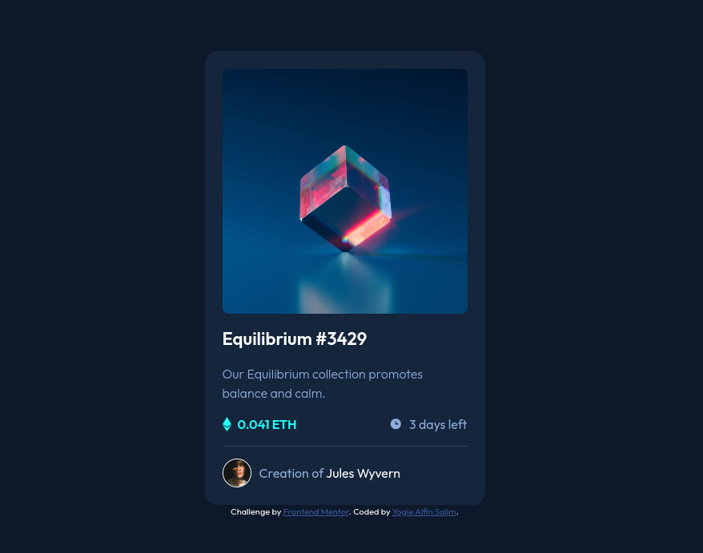

# Frontend Mentor - NFT preview card component

## Welcome! 👋

This is a solution to the [NFT preview card component challenge on Frontend Mentor](https://www.frontendmentor.io/challenges/nft-preview-card-component-SbdUL_w0U).

### Links

- Solution URL: (https://github.com/yogiealfin/frontend-mentor/tree/main/nft-preview-card-component)
- Live Site URL: (https://yogiealfin.github.io/frontend-mentor/nft-preview-card-component/)

### Built with

- Semantic HTML5
- CSS
- CSS Custom Properties
- CSS Grid
- Flexbox

**Have fun building!** 🚀
