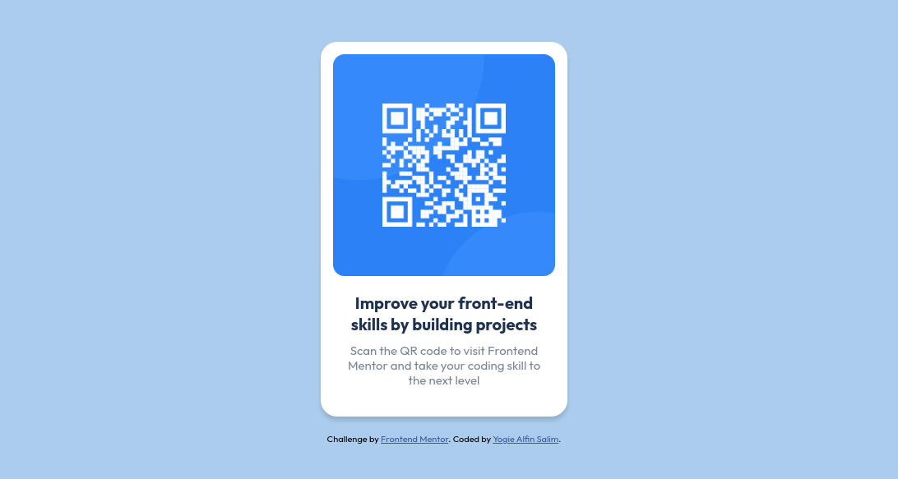

# Frontend Mentor - QR code component

## Welcome! 👋

This is a solution to the [QR code component challenge on Frontend Mentor](https://www.frontendmentor.io/challenges/qr-code-component-iux_sIO_H).

### Links

- Solution URL: (https://github.com/yogiealfin/frontend-mentor/tree/main/qr-code-component)
- Live Site URL: (https://yogiealfin.github.io/frontend-mentor/qr-code-component/)

### Built with

- Semantic HTML5
- CSS
- Flexbox

**Have fun building!** 🚀
