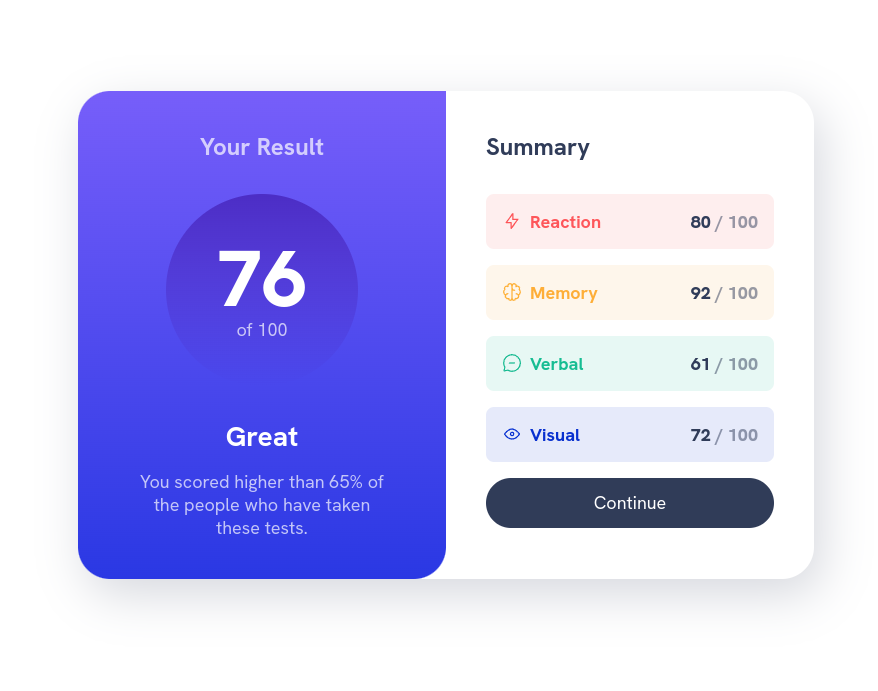

# Frontend Mentor - Results summary component

## Welcome! 👋

This is a solution to the [Results summary component challenge on Frontend Mentor](https://www.frontendmentor.io/challenges/results-summary-component-CE_K6s0maV).

### Links

- Solution URL: (https://github.com/yogiealfin/frontend-mentor/tree/main/results-summary-component)
- Live Site URL: (https://yogiealfin.github.io/frontend-mentor/results-summary-component/)

### Built with

- Semantic HTML5
- CSS
- Flexbox
- CSS Grid
- CSS Custom Properties
- Mobile-first Workflow

### What I learned

I learn how to use data attribute to subtitute it from making another class

**Have fun building!** 🚀
